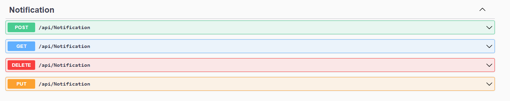
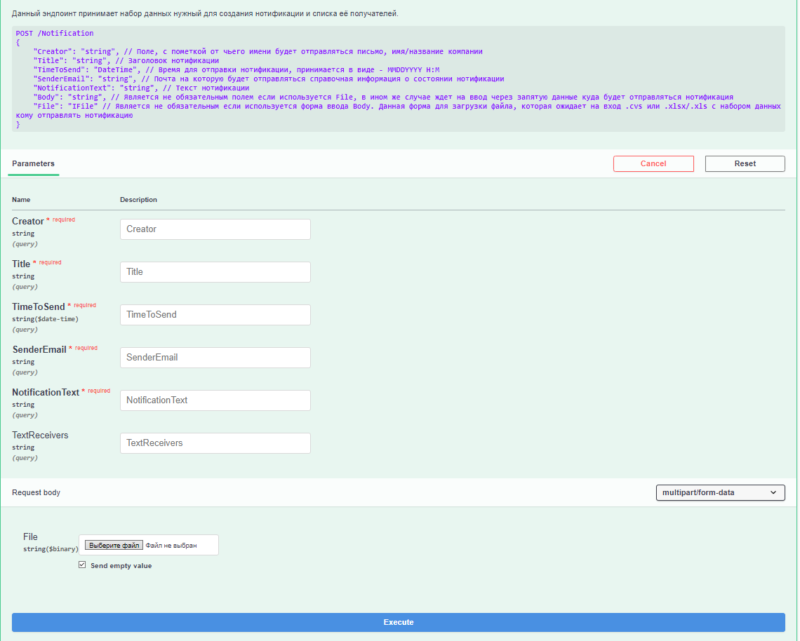
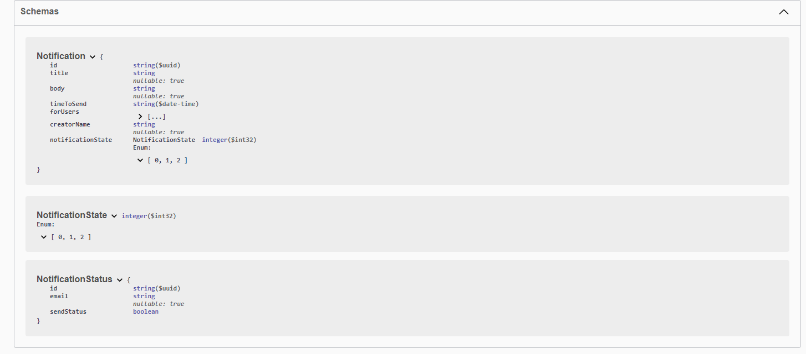
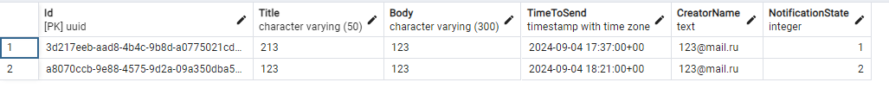
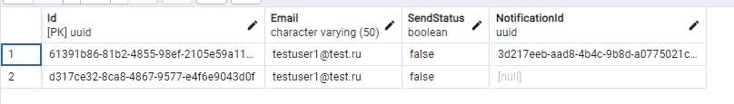

# Generic notifications Service

## Оглавление
- [Описание сервиса](#описание-сервиса)   
- [Cтруктура БД](#структура-бд-в-postgresql)

## Описание сервиса
Этот сервис отвечает за принтия нотификации и её формирования в вид для отправки передавая его в notificationSender через RabbitMQ. Так же можно получить состояние нотификации из БД 

Используется ASP.NET CORE 8 как главный фреймворк, вспомогательно используется Serilog для ведения лога, а для взаимодействия с БД - EFCore. Так же в проекте используется юнит тестирование для бизнес логики.
___

Доступ к сервису осуществляеться по пути - https://localhost:7125/  
Swagger - https://localhost:7125/swagger   
Для изменения DNS имени нужно отредактировать файл [launchSettings.json](GenericNotification.API/Properties/launchSettings.json)
___
#### В проекте для наглядности и удобства отладки функционала подключен Swagger 
___
##### API - Входная точка к АПИ
##### Domain - Сущности
##### DAL - доступ к БД
##### Application - Бизнес логика
##### Tests - Юнит тесты
##### Producer - Продюсер для RabbitMQ

___
Эндпоинты для взаимодействия с сервисом

Описание эндпоита

Модели которые принимает тот или иной метод контроллера
   
___
## Структура БД в Postgresql  
Табличка Notifications хранит конкретную нотификацию и сопутствующую к ней информацию
   
Id - uuid нотификации  
Title - Заголовок нотификации  
Body - Тело нотификации  
TimeToSend - пишется сводиться к UTC чтобы избежать проблем с регионами   
CreatorName - Имя отправителя  
NotificationState:   
0 - Не настало время отправки   
1 - В обработке   
2 - Отправлено   
___
Табличка NotificationStatus хранит конретного получателя и информацию к которой нотификации он пренадлежит.
 
Id - uuid получателя   
Email - Почта получателя   
SendStatus - Статус отправки конкретному получателю
NotificationId - uuid нотификации к которой привязан получатель