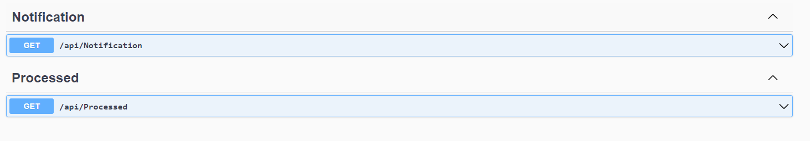
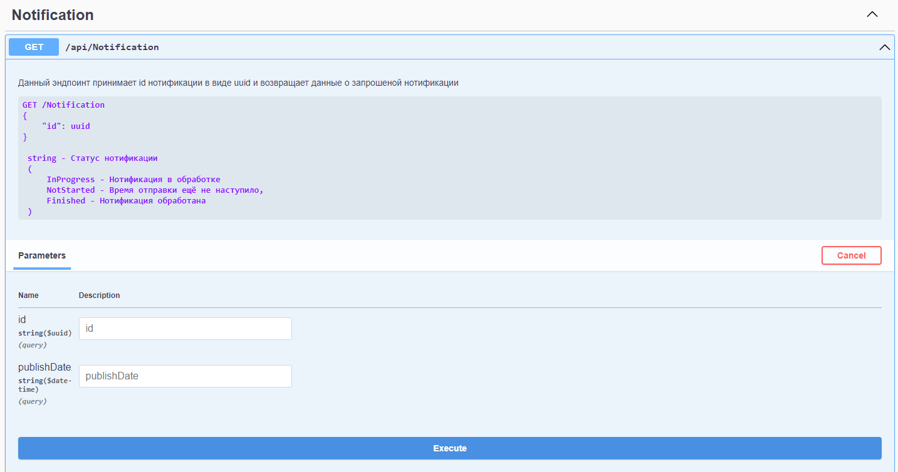

# Notification Sender Service

## Оглавление
- [Описание сервиса](#описание-сервиса)   
- [Redis структура](#структура-redis-для-хранения-нотификаций)

## Описание сервиса
Этот сервис отвечает за отправку нотификаций в службу которая настроена в [конфиг](NotificationSender.API/appsettings.json) файле. В данный момент реализована отправка только на почтовый сервер. На эж

Используется ASP.NET CORE 8 как главный фреймворк, вспомогательно используется Serilog для ведения лога, а для взаимодействия с БД - EFCore. Так же в проекте используется юнит тестирование для бизнес логики.
___

Доступ к сервису осуществляеться по пути - https://localhost:7022/  
Swagger - https://localhost:7022/swagger   
Для изменения DNS имени нужно отредактировать файл [launchSettings.json](GenericNotification.API/Properties/launchSettings.json)
___
#### В проекте для наглядности и удобства отладки функционала подключен Swagger 
___
##### API - Входная точка к АПИ
##### Domain - Сущности
##### DAL - доступ к БД
##### Application - Бизнес логика
##### Tests - Юнит тесты
##### Consumer - Потребитель очереди из RabbitMQ
___
Эндпоинты для взаимодействия с сервисом

Описание эндпоита

____
## Структура Redis для хранения нотификаций
Redis Хранит нотификации которые сервис должен отправить в текущий день, которые получает от GenericNotification либо в начале, либо в течении дня через RabbitMQ. Каждую минуту база проверяться на наличие нотификаций для отправки в данную минуту, при наличие таких они загружаются в сервис и отправляются.   
Структура выглядит:
```CMD
Redis {
    TimeToSend округленный до секунд {
        uuid notification 
        {
            // Notification 
        },
        uuid notification
        {
            // Notification
        }
    },
    TimeToSend {
        uuid notification 
        {
            // Notification 
        },
        uuid notification
        {
            // Notification
        }
    },
}
```