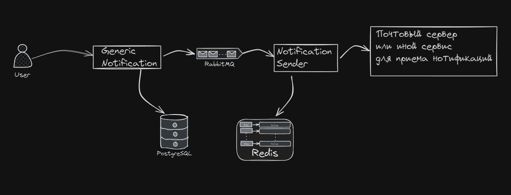

# Generic notifications
___
## Технологии


___
## Краткое описание проекта
Веб-приложение созданное для рассылки уведомлений группе пользователей, для удобства приложение написано в виде двух микросервисов. Первый отвечает за обработку поступившего уведомления и установкой его даты отправки, второй за отправку его в срок. Основная информация о уведомлениях храниться в базе данных Postgres, уведомления которые должны отправиться в текущий день хранятся в оперативной памяти по средствам Redis, а микросервисы связанны между собой брокером сообщений RabbitMQ

Поверхностная схема всего проекта


В данном репозитории предаставляеться сервис Notification Sender который отправляет письма на почтовый сервер
___

## Установка и запуск
В данном виде, сервис пока может взаимодействовать только с почтовым сервером, для тестирования в директории [mail/](mail/README.md) лежит файл с readme для тестового почтового сервера который можно запустить, если нет возможности взаимодействовать с другими почтовыми серверами. Если не планируется его использовать, то в файле [appsettings.json](Microservices/NotificationSender/NotificationSender.API/appsettings.json) нужно изменить подключение к почтовому серверу на тот, который планируется использовать.

```CMD
git clone https://github.com/AxVol/GenericNotification.git
cd {путь до папки c репозиторием}
docker-compose up
```
___
### Подробные README
[Generic Notification](Microservices/GenericNotification/README.md)
[Notification Sender](Microservices/NotificationSender/README.md)